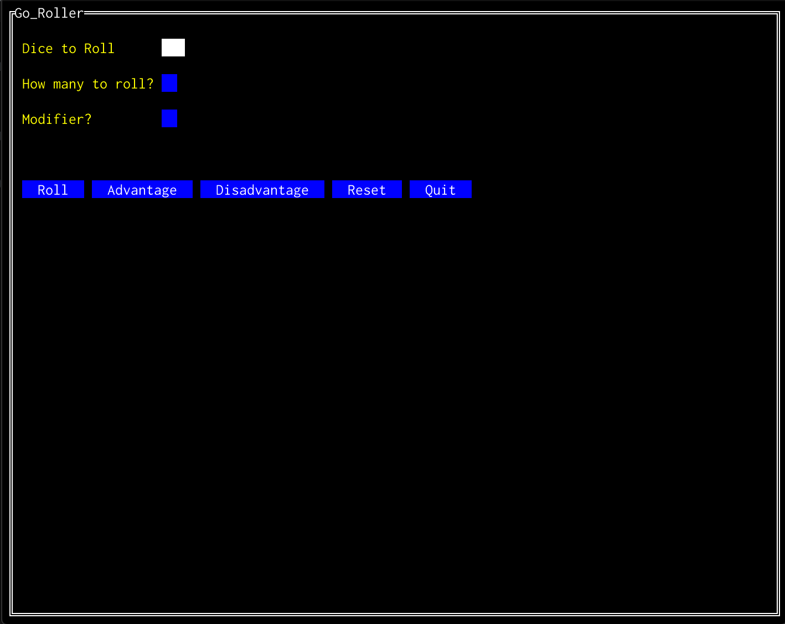
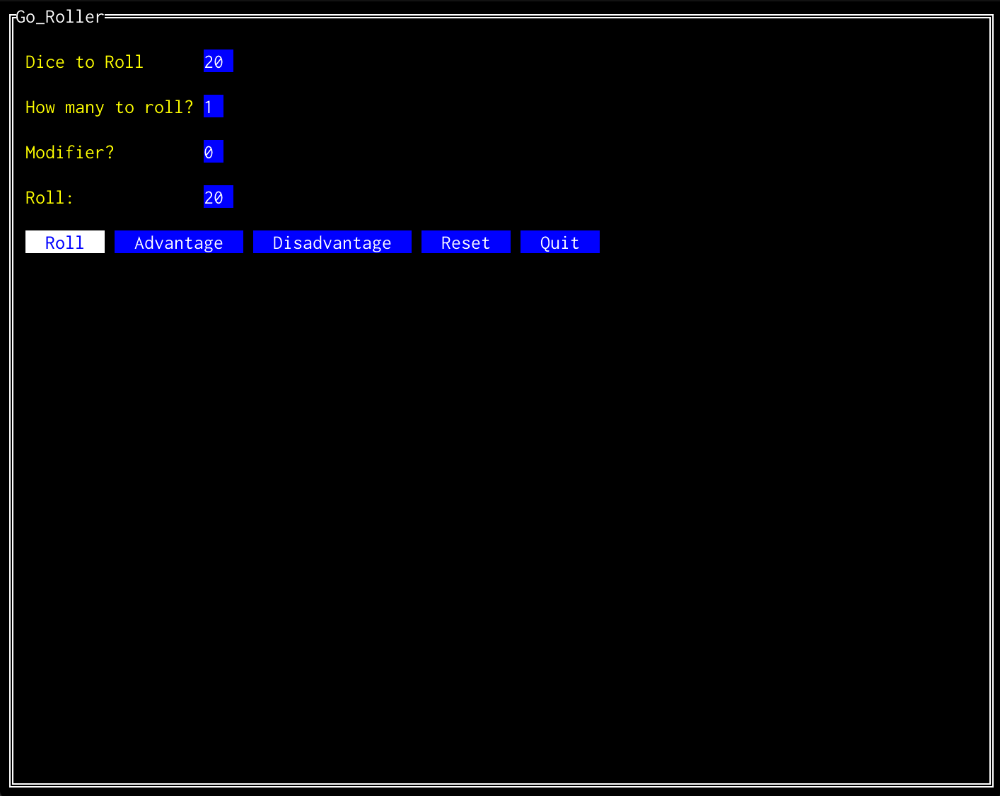

# go_roller
DnD dice roller written in go which uses tview as a CLI GUI for making your rolls.

The roller has the ability to make normal rolls with d4 through d100 and can also roll with advantage and disadvantage.

To use the GUI run `make build` and then `make run`.

